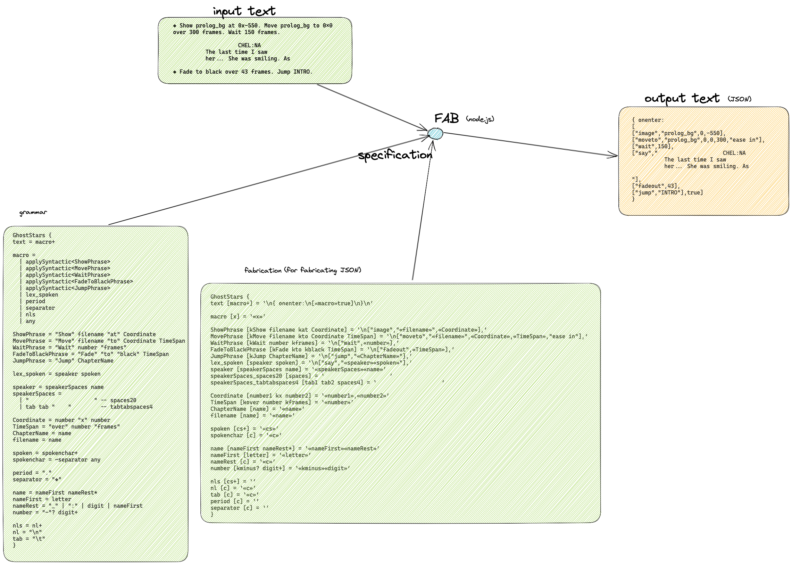

FABricate new text from input source text.

Command-line utility to transpile input source text and apply fabrication rules to generate new text.



# Exit Code
Exit code 0 on success. `stdout` contains new text.

Exit code 1 on failure.  `stdout` contains error messages on failure.

# Usage
```
$ fab srcFilename grammarName grammarFilename fmtFilename
```
or
```
$ fab - grammarName grammarFilename fmtFilename <srcText
```

# Build
make install
make

# Further Detail
See doc/documentation.

# Test
see other repos `fabghoststars`, `parsingexplorer`, `fabx`

